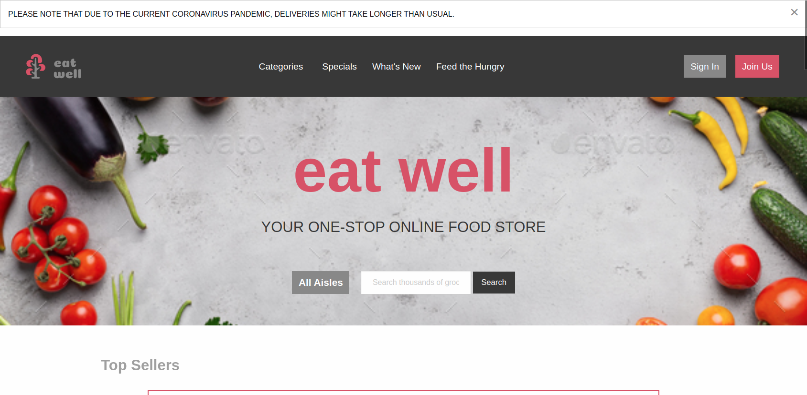
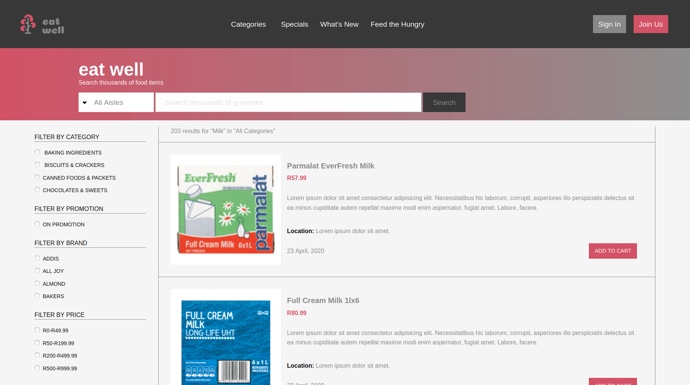

# Online Shopping Food Market

> This project is an online shopping food market where the home page and search results page have been created.

This project includes the following:

1. A homepage that displays the different products
2. A search results page
3. Responsive design for desktop, tablet and mobile
4. Coronavirus delivery alert

## Built With

- HTML5, CSS and Sass
- Foundation 6
- Font Awesome

## Live Demo

[Live Demo Link](https://rawcdn.githack.com/Azeem838/online-shopping-food-market/4b69c641cbd0d136951e3f6b88cb40c27325bb41/index.html)

👤 **Azeem Ahmed**

- Github: [@Azeem838](https://github.com/Azeem838)

## 🤝 Contributing

Contributions, issues and feature requests are welcome!

Feel free to check the [issues page](https://github.com/Azeem838/online-shopping-food-market/issues).

## Show your support

Give a ⭐️ if you like this project!

## Acknowledgments

- Thanks to Mohammed Awad (https://www.behance.net/M_Awad) on Behance for the design and layout.

## 📝 License

This project is [MIT](lic.url) licensed.
