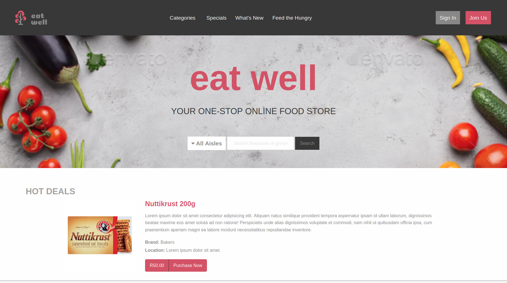

# Online Shopping Food Market

> This project is an online shopping food market where the home page and search results page have been created.

This project includes the following:

1. A homepage that displays the different products
2. A search results page
3. Responsive design for desktop, tablet and mobile
4. Coronavirus delivery alert

## Built With

- HTML5, CSS and Sass
- Foundation 6
- Font Awesome

## Live Demo

[Live Demo Link](https://livedemo.com)

## Getting Started

**This is an example of how you may give instructions on setting up your project locally.**
**Modify this file to match your project, remove sections that don't apply. For example: delete the testing section if the currect project doesn't require testing.**

To get a local copy up and running follow these simple example steps.

### Prerequisites

### Setup

### Install

### Usage

### Run tests

### Deployment

## Authors

👤 **Azeem Ahmed**

- Github: [@Azeem838](https://github.com/Azeem838)

## 🤝 Contributing

Contributions, issues and feature requests are welcome!

Feel free to check the [issues page](issues/).

## Show your support

Give a ⭐️ if you like this project!

## Acknowledgments

- Thanks to Mohammed Awad (https://www.behance.net/M_Awad) on Behance for the design and layout.

## 📝 License

This project is [MIT](lic.url) licensed.
